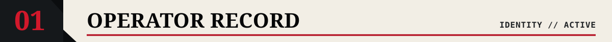
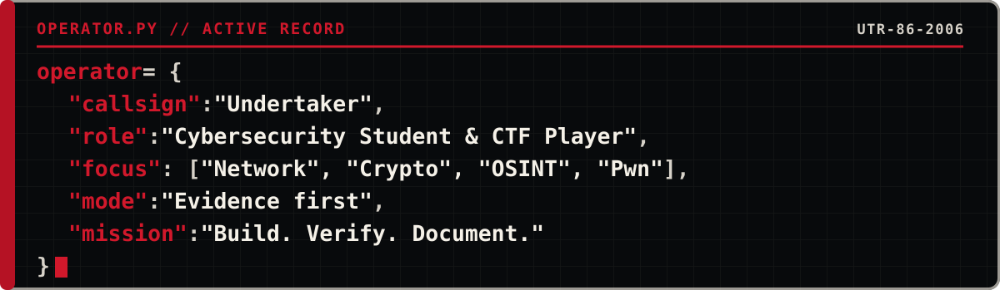
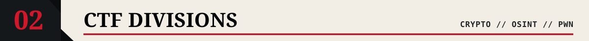
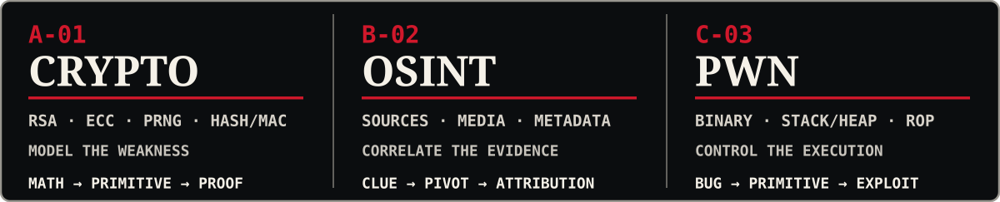
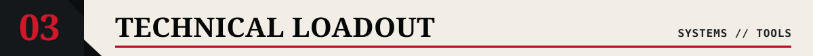
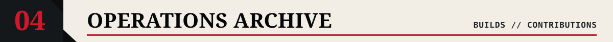
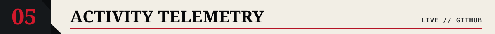
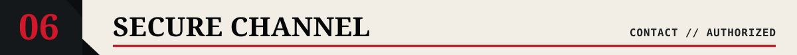

  

  

  
  
  

### I study how systems fail—and how to make them harder to break.

### Network security · reproducible CTF solving · technical documentation · systems projects.

> ### Field rule: collect evidence → isolate the primitive → verify the result → document the path.

  

  
  
  
  
  
  
  

  
<strong>CURRENT TRAINING QUEUE // OPEN FILE</strong>

   
  <ul>
    <li><strong>Binary exploitation:</strong> turning memory-corruption bugs into reliable primitives.</li>
    <li><strong>Applied cryptanalysis:</strong> separating implementation mistakes from mathematical weaknesses.</li>
    <li><strong>Network security:</strong> packet visibility, service hardening, and attack detection.</li>
    <li><strong>Malware analysis:</strong> static triage, behavior tracing, and configuration extraction.</li>
  </ul>

<table width="100%">
  <tr>
    <td width="50%" valign="top">
      OPERATION 01 // CRYPTO
      <h3><a href="https://github.com/minhducngo2006/ctf-crypto-handbook">CTF Crypto Handbook</a></h3>
      <h3>11 chapters for recognizing primitives, building solvers, and verifying flags.</h3>
      
<code>Python</code> <code>SageMath</code> <code>CryptoHack</code> <code>CTF</code>

      
<a href="https://github.com/minhducngo2006/ctf-crypto-handbook">OPEN FIELD GUIDE →</a>

    </td>
    <td width="50%" valign="top">
      OPERATION 02 // SYSTEMS
      <h3><a href="https://github.com/minhducngo2006/networkprg_group1">Distributed System Monitor</a></h3>
      <h3>C++20 multi-host monitoring with Linux agents, alerts, Prometheus, and Docker.</h3>
      
<code>C++20</code> <code>Linux</code> <code>Networking</code> <code>Docker</code>

      
<a href="https://github.com/minhducngo2006/networkprg_group1">OPEN SYSTEM →</a>

    </td>
  </tr>
  <tr>
    <td width="50%" valign="top">
      OPERATION 03 // MCP HOST
      <h3><a href="https://github.com/minhducngo2006/botquanganh_mcp">BotQuangAnh MCP Runbook</a></h3>
      <h3>Vietnamese quick-start for installing, running, and securing an MCP host.</h3>
      
<code>MCP</code> <code>Runbook</code> <code>Security</code> <code>Vietnamese</code>

      
<a href="https://github.com/minhducngo2006/botquanganh_mcp">OPEN RUNBOOK →</a>

    </td>
    <td width="50%" valign="top">
      OPERATION 04 // OPEN SOURCE
      <h3><a href="https://github.com/sherlock-project/sherlock/pull/3081">Sherlock PR #3081</a></h3>
      <h3>Fixes Instapaper false positives by detecting its fallback response.</h3>
      
<code>OSINT</code> <code>Python</code> <code>F+ PASS</code> <code>F− PASS</code>

      
<a href="https://github.com/sherlock-project/sherlock/pull/3081">UNDER REVIEW →</a>

    </td>
  </tr>
</table>

TRAINING RECORD // <a href="https://github.com/minhducngo2006/pp2025">USTH ADVANCED PYTHON 2025</a>

  

  

  <picture>
    <source media="(prefers-color-scheme: dark)" srcset="https://raw.githubusercontent.com/minhducngo2006/minhducngo2006/output/github-contribution-grid-snake-dark.svg" />
    <source media="(prefers-color-scheme: light)" srcset="https://raw.githubusercontent.com/minhducngo2006/minhducngo2006/output/github-contribution-grid-snake.svg" />
    
  </picture>

  
  

  AUTHORIZED ENVIRONMENTS ONLY // LEARN · VERIFY · DOCUMENT

