<p align="center">
  
</p>

<p align="center">
  <a href="https://git.io/typing-svg">
    
  </a>
</p>

<p align="center">
  
  <a href="https://github.com/minhducngo2006?tab=followers"></a>
  
</p>

---

## `$ whoami`

```python
operator = {
    "alias": "Undertaker",
    "role": "Cybersecurity Student & CTF Player",
    "focus": ["Network Security", "Cryptography", "OSINT", "Pwn"],
    "mindset": "Understand the system. Find the weakness. Prove the impact.",
    "current_mission": "Turn every solved challenge into reusable knowledge."
}
```

I explore how systems fail—and how to make them harder to break. My work sits at the intersection of **network security**, **offensive security**, and reproducible **CTF problem-solving**. I enjoy reducing noisy evidence into a clean attack path, then documenting the reasoning so the solution can be repeated.

> **Operating principle:** No guessing. Collect evidence, build a primitive, verify the result.

## `./ctf_focus --list`

<table width="100%">
  <tr>
    <td width="33.33%" align="center" valign="top">
      <h3>🔐 Crypto</h3>
      <p>RSA • ECC • PRNG<br />Classical ciphers • Hash/MAC<br />Python • SageMath</p>
      <code>math → weakness → plaintext</code>
    </td>
    <td width="33.34%" align="center" valign="top">
      <h3>🛰️ OSINT</h3>
      <p>Source correlation • Metadata<br />Image/video investigation<br />Timeline & identity pivots</p>
      <code>clue → pivot → attribution</code>
    </td>
    <td width="33.33%" align="center" valign="top">
      <h3>💥 Pwn</h3>
      <p>Binary analysis • Stack/heap<br />ROP • Format strings<br />GDB • pwntools</p>
      <code>bug → primitive → exploit</code>
    </td>
  </tr>
</table>

## `cat /opt/undertaker/toolkit`

<p align="center">
  
</p>

<p align="center">
  
  
  
  
  
  
  
</p>

<details>
  <summary><strong>⚙️ Current learning queue</strong></summary>
  <br />
  <ul>
    <li>Binary exploitation: turning memory-corruption bugs into reliable primitives</li>
    <li>Applied cryptanalysis: identifying implementation mistakes before attacking the math</li>
    <li>Network security: packet-level visibility, service hardening, and attack detection</li>
    <li>Malware analysis: static triage, behavioral analysis, and configuration extraction</li>
  </ul>
</details>

## `ls -la featured_operations/`

<table>
  <tr>
    <td width="50%" valign="top">
      <h3><a href="https://github.com/minhducngo2006/ctf-crypto-handbook">CTF Crypto Handbook</a></h3>
      <p>A practical field guide for CTF cryptography: recognize the primitive, model the weakness, build a solver, and verify the result.</p>
      <p><code>Cryptography</code> <code>Python</code> <code>SageMath</code> <code>CTF</code></p>
      <p><a href="https://github.com/minhducngo2006/ctf-crypto-handbook">Browse the handbook →</a></p>
    </td>
    <td width="50%" valign="top">
      <h3><a href="https://github.com/minhducngo2006/networkprg_group1">Distributed System Monitor</a></h3>
      <p>A C++20 multi-host monitor with an ncurses dashboard, Linux agents, alerts, Prometheus endpoints, and Docker support.</p>
      <p><code>C++20</code> <code>Linux</code> <code>Networking</code> <code>Docker</code></p>
      <p><a href="https://github.com/minhducngo2006/networkprg_group1">Open the repository →</a></p>
    </td>
  </tr>
</table>

## `./github_activity --live`

<p align="center">
  
</p>

<p align="center">
  
</p>

## `cat contact.txt`

<p align="center">
  <a href="https://github.com/minhducngo2006"></a>
  <a href="mailto:minhpticc@gmail.com"></a>
</p>

<p align="center">
  <picture>
    <source media="(prefers-color-scheme: dark)" srcset="https://raw.githubusercontent.com/minhducngo2006/minhducngo2006/output/github-contribution-grid-snake-dark.svg" />
    <source media="(prefers-color-scheme: light)" srcset="https://raw.githubusercontent.com/minhducngo2006/minhducngo2006/output/github-contribution-grid-snake.svg" />
    
  </picture>
</p>

<p align="center">
  <sub>Always learning. Always documenting. Only hacking what I am authorized to test.</sub>
</p>


